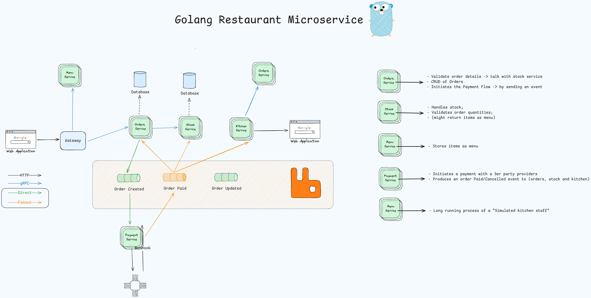

# Order Management System

*A microservices-based system for managing orders and processing payments*

## Requirements for running the project
- Go 1.22+.
- Golang cosmtrek/air for hot-reloading.
- gRPC for communication between services.
- RabbitMQ as message broker.
- Docker with docker compose.
- MongoDB as storage layer.
- Jaeger for service tracing.
- HashiCorp's Consul for service discovery.
- Stripe for payments.

## Go documentation
- Multi-module workspaces: [https://go.dev/doc/tutorial/workspaces](https://go.dev/doc/tutorial/workspaces)

## Microservice architecture

